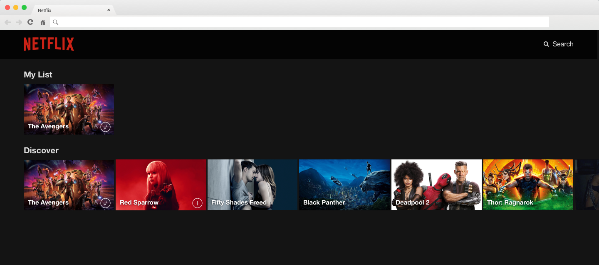

# Netflix (React-Only)

In this exercise you continue the journey into the art of movie apps. You need to create a light version of Netflix, that allows users to store movies into custom lists.

## What to expect

React is a component-based framework for building user interfaces. Explore how it is much more lightweight than Angular. It still requires you to learn JSX and consider how React's virtual DOM.

You will be using JavaScript's experimental [fetch](https://developer.mozilla.org/en-US/docs/Web/API/Fetch_API) API.

## Learning objectives

While you are going through the exercise, keep in mind the following learning objectives. If by the end you don’t feel you have accomplished these objectives, please reach out to an instructor or TA.

1. Define and use React components in a production-like environment.
2. Use JSX to produce React elements.
3. Understand how one-way data flow works with nested components.
4. Differentiate between container and presentational components.
5. Explore different frameworks and options you have available, noticing the pros and cons of each one.
6. Be able to figure out how to setup your environment with the different toolsets needed.
7. Become confident in your ability to create something in a new language or framework (very handy since you will need this often in your career).
8. Embrace being uncomfortable while learning new technologies. As we say, get comfortable being uncomfortable!

## Getting started

To install the required dependencies, run `npm install` from the project folder.

## Tasks

Follow best practices such as commenting your code, committing often and being mindful of indentation. Make sure to lint your code before committing, as this will help your work look professional.

1. Use the React CLI to set-up the client folder, running `create-react-app client`. Then from the newly created folder launch your app with `npm start`.
2. Build a “Discover” section, rendering the list of movies provided at `https://movied.herokuapp.com/discover`.
3. Build a “My List” section, where users can add and remove movies.
    - If the section is empty, don’t show it.
    - Every movie has an “Add to My List” button, which appears only on mouse hover.
    - Clicking the button adds / removes the movie from “My List” and switches the button between the “plus” and the “tick” sign (you find the required images in the `./assets` folder).
    - The logic of this behavior should neither be in the movie render component nor in the movie list component.

## Extra credits

- Add another section of movies (e.g. “Action” movies). Keep in mind that when a movie is added to “My List” from any section, its “Add to my list” button should be updated in all lists at the same time.
- Persist the user data in the browser.
